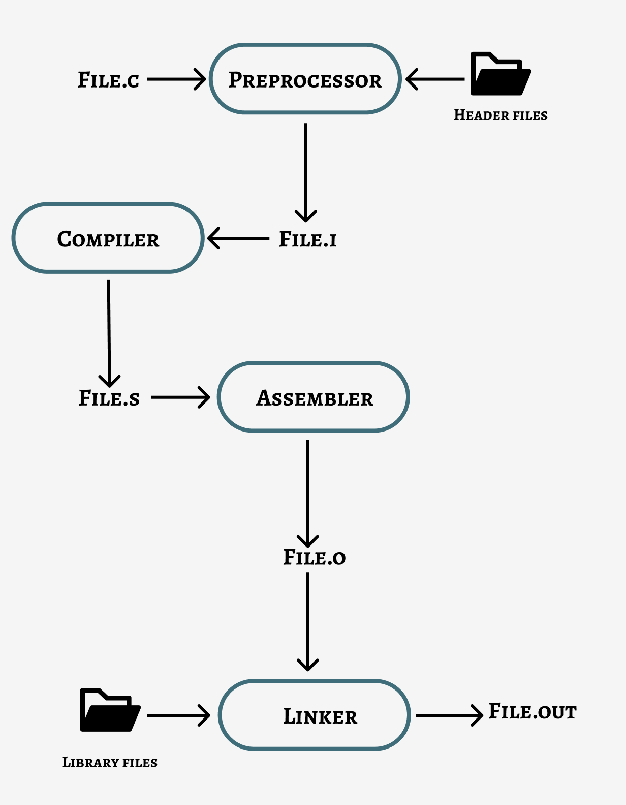

# My-notes-about-compilation-in-C

The compilation process in C is transforming human-readable code into a machine-readable format. It involves four steps: pre-processing, compiling, assembling, and linking then we get the final executable file that we can run.

## 1. Pre-Processing

Pre-processing is the first step in the compilation process, performed using the pre-processor (a pre-written program invoked by the system during the compilation).

All the statements starting with the ‘#’ symbol are processed by the pre-processor, which converts our file into another file with no ‘#’ statements.

1. It removes the comments.
2. It expands the macros (macros are just some constant values or expressions defined using “#define”).
3. Files inclusion: it adds the files containing some pre-written code into our file, it’s done using the “#include”. e.g.:(#include <unistd.h>), in the pre-processor step this will add the entire content of the file (unistd.h) in our source code

At the end of this step, our (file.c) will be an intermediate (file.i)

## 2. Compiling

Compiling step will converts our intermediate (file.i) into an assembly (file.s) containing assembly-level instructions (low-level code). This phase boosts the performance of our program.

## 3. Assembling

In this step, Assembly level code (file.s) is converted into machine-readable code (in binary form) using an assembler. The assembler is a pre-written program that takes basic instructions from the assembly code file and converts them into binary code known as the object code.

At the end of this phase our (file.s) will be converted into a (file.o) or (file.obj) (o nad obj stand for object).

## 4. Linking

Linking is the process of including the library files into our program. Library files are some pre-defined files that contain the definition of the functions in machine language and they have (.lib)

extension. Our operating system may not understand some statements written in the (file.o),

we use library files to give meaning to those unknown statements that our operating system can’t understand.

At the end of this phase an executable file will be generated (file.exe) or (file.out).

> This was a short explanation of the compilation process, the image below concludes all its steps:
> 

